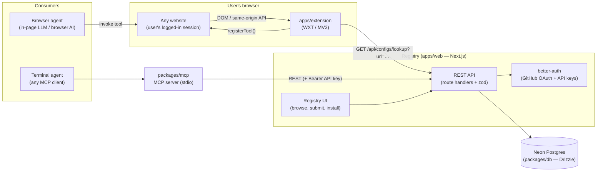
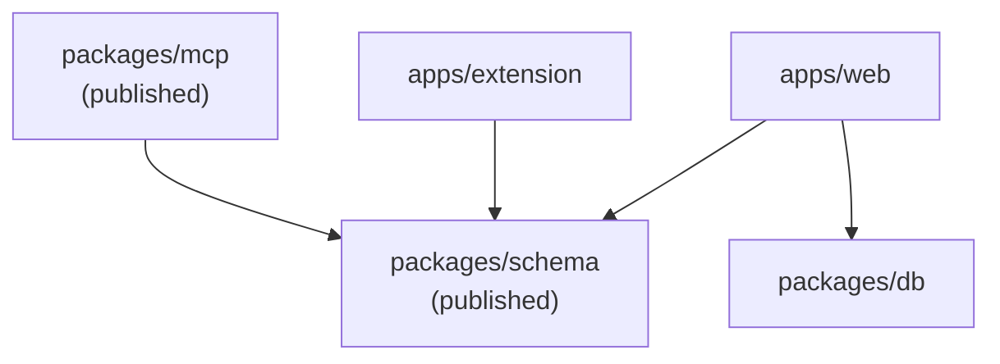
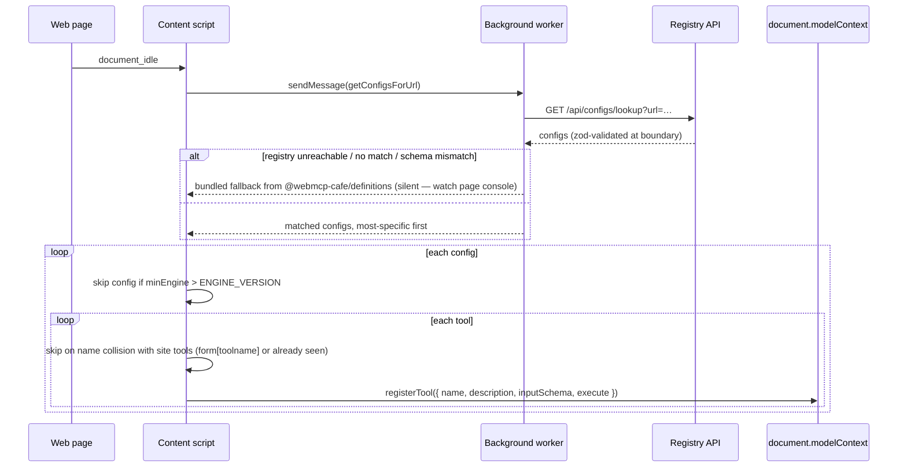
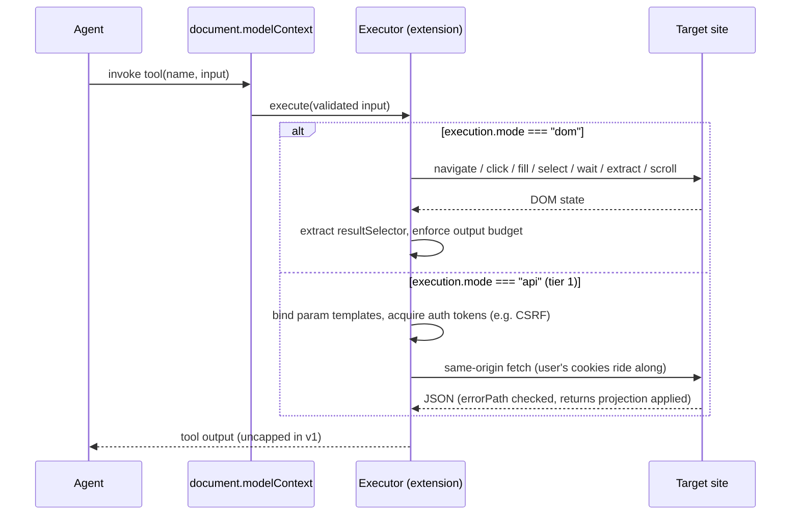
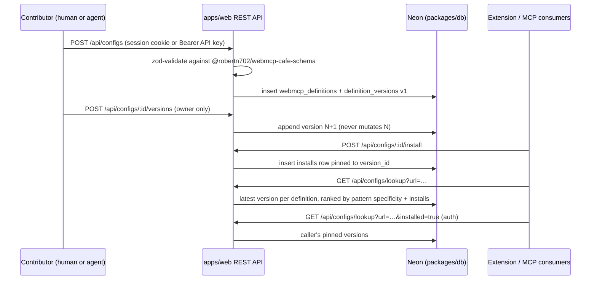

# WebMCP Cafe — Architecture

Community registry of third-party **WebMCP tool configs** injected into sites that
haven't implemented WebMCP — "Greasyfork for the agentic web". This document is the
map of how the pieces fit together. Companion docs:

| Need                    | File                                                             |
| ----------------------- | ---------------------------------------------------------------- |
| Stack + conventions     | `AGENTS.md`                                                      |
| Data model (ERD)        | `docs/erd.md`                                                    |
| API execution model     | `docs/api-execution-model.md`                                    |
| Config format (history) | `SPEC.md` (historical — code + `AGENTS.md` win on disagreements) |
| Web app specifics       | `apps/web/AGENTS.md`                                             |
| Extension specifics     | `apps/extension/AGENTS.md`                                       |

## System overview

Three deployables and two libraries, all revolving around one shared config format:



- **`apps/web`** — the registry. Next.js UI for humans + public REST API for
  everything else. Owns auth (better-auth) and all persistence.
- **`apps/extension`** — the delivery mechanism. A content script on every page asks
  the background worker for configs matching the URL, then registers their tools via
  `document.modelContext.registerTool()` so in-page agents can call them. Falls back
  to bundled configs when the registry is unreachable.
- **`packages/mcp`** — a stdio MCP server so terminal agents can search, publish, and
  install configs without a browser. Thin client over the same REST API.
- **`packages/schema`** — the keystone. The zod config format every consumer validates
  against; published as `@robertn702/webmcp-cafe-schema`.
- **`packages/db`** — Drizzle schema + Neon client, shared by `apps/web`.

## Package dependency graph



`packages/schema` has no inbound dependencies and is resolved via its built `dist/` —
rebuild it after schema changes or consumers see bizarre validation errors. Turbo
fans out `build`/`typecheck`/`test` with `dependsOn: ["^build"]`, so schema always
builds first.

## Runtime flow — tool registration (extension)



Key behaviors:

- The fetch happens in the **background worker** (page CSP would block it from the
  content script), but all logging lands in the **page console**.
- **Silent-fallback trap:** any failure falls back to bundled configs, so a "working"
  test may never touch the registry. The ground-truth log line is
  `[webmcp-cafe] Using N config(s) from the registry`.
- **Engine gate:** a config whose `minEngine` exceeds the extension's level is skipped
  wholesale — a too-new config must never register inert or mis-executed tools.

## Runtime flow — tool invocation



Two execution modes, selected per tool:

- **DOM mode** — declarative step choreography ported from Joakim Selemyr's MIT
  webmcp-extension (native value setters to defeat React overrides, synthetic paste
  events for Lexical/Draft, shadow-DOM traversal, trusted `el.click()`). No `evaluate`
  step — no arbitrary code in the user's logged-in page.
- **API mode (tier 1)** — the config declares the site's own HTTP API as data
  (`api.endpoints`, `auth` token sources, `returns` projections); the executor derives
  and performs the call. Ships zero code. The load-bearing invariant: **all network
  access is same-origin with the config's `urlPatterns`**, enforced at publish and
  again at execution. Tiers 2–3 (scoped script slots, full `evaluate`) are designed
  but not shipped — see `docs/api-execution-model.md`.

`destructiveHint` tools gate on a blocking `window.confirm` — writes wait for a human.

## Data flow — publish, install, serve



The model in one breath: `webmcp_definitions` is the one mutable row per package
(title/description/tags/domain); `definition_versions` is append-only and **is** the
served truth (no snapshot table); `installs` pins user→version and doubles as the
trust signal (`COUNT(*) GROUP BY definition_id`, computed at query time). Installed
users never auto-update — moving the pin is an explicit `POST …/update`, and rollback
is pinning to an older version. Full schema: `docs/erd.md`.

## Config format

A config is pure data — `{ domain, urlPatterns[], title, description, tools[], api?, changelog? }`,
validated by zod in `packages/schema`:

- `urlPatterns` — Chrome `@match`-style; used for lookup, ranking
  (`rankConfigsByUrl`), and same-origin enforcement of `api.baseUrl`.
- `tools[]` — `{ name, description, inputSchema, annotations?, execution? }` with
  WebMCP metadata budgets enforced (500/description, 150/param, 30/name — tool output
  is uncapped in v1; `packages/schema/src/budgets.ts`).
- `minEngine` — positive-integer capability level per version; lets the format evolve
  without old executors silently mis-running new configs.
- Placeholders (`{{param}}`, double-brace) may only name `inputSchema` properties —
  cross-validated at the schema level for both DOM steps and API endpoints.

## Auth & trust

- **Auth (apps/web):** better-auth — GitHub OAuth + email/password for the browser
  (session cookies); API keys (`Authorization: Bearer …`) for agents. The apiKey
  plugin keys owners as `reference_id`, not `user_id` — keep
  `packages/db/src/apikey-schema.ts` matched to the plugin. Auth tables are plural
  snake_case in SQL (`users`, `api_keys`, …) but keep singular drizzle **export**
  names, which is the only name better-auth resolves (`apps/web/AGENTS.md` § Auth).
- **Trust = install count, not verification.** No per-tool verification, no approval
  gate: rival packages may target the same site, and installs + pattern specificity
  rank them. Version pinning is the containment mechanism — a malicious or broken
  update reaches zero installed users until each opts in (the Greasyfork model).

## Repository & build topology

```
webmcp-cafe/
├── apps/
│   ├── web/            # Next.js — registry UI + public REST API (port 3000)
│   └── extension/      # WXT — config lookup + tool injection (dev port 5173, CDP 9222)
├── packages/
│   ├── schema/         # @robertn702/webmcp-cafe-schema — zod config format (published)
│   ├── db/             # Drizzle + Neon — schema + client
│   └── mcp/            # @robertn702/webmcp-cafe-mcp — MCP server (published)
└── docs/               # erd.md, api-execution-model.md, DECISIONS.md
```

- Bun workspaces + Turborepo; root `bun run typecheck && bun run lint && bun run test`
  is the pre-commit gate (same as CI).
- Publishing uses Changesets; published packages list `LICENSE` in `files`.
- Local dev needs Chrome 149+ with WebMCP flags for the extension
  (`--enable-features=WebMCP,WebMCPTesting,DevToolsWebMCPSupport`) and a Neon
  `DATABASE_URL` + GitHub OAuth + `BETTER_AUTH_SECRET` for the web app.
