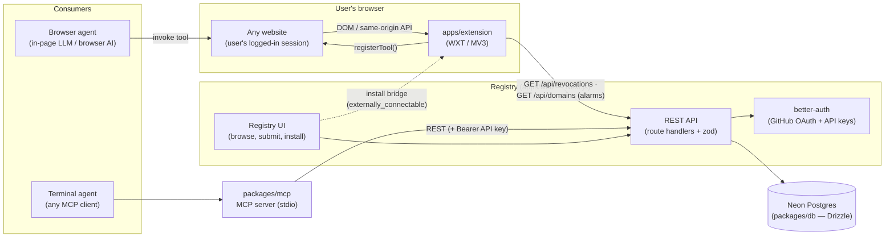
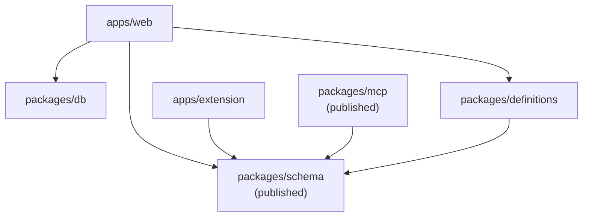
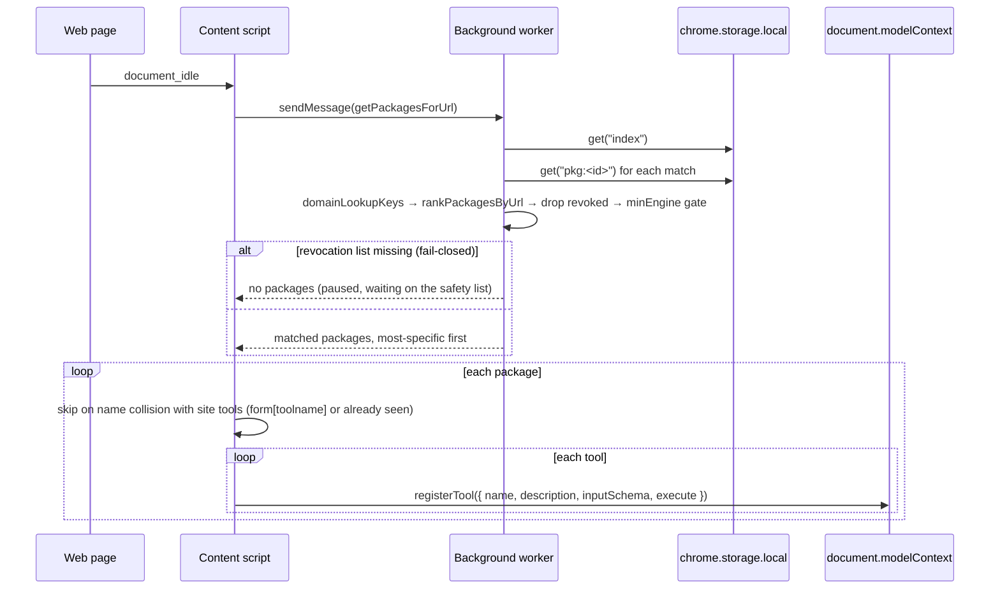
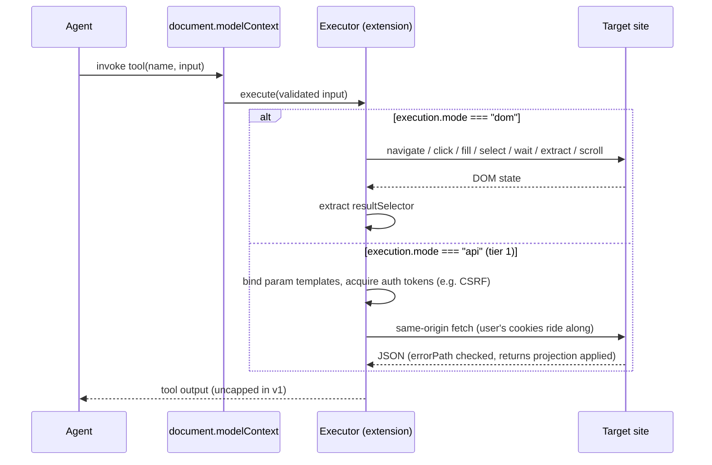

# WebMCP Cafe — Architecture

Community registry of third-party **WebMCP tool packages** injected into sites that
haven't implemented WebMCP — "Greasyfork for the agentic web". This document is the
map of how the pieces fit together. Companion docs:

| Need                     | File                                                             |
| ------------------------ | ---------------------------------------------------------------- |
| Stack + conventions      | `AGENTS.md`                                                      |
| Data model (ERD)         | `docs/erd.md`                                                    |
| API execution model      | `docs/api-execution-model.md`                                    |
| Package format (history) | `SPEC.md` (historical — code + `AGENTS.md` win on disagreements) |
| Web app specifics        | `apps/web/AGENTS.md`                                             |
| Extension specifics      | `apps/extension/AGENTS.md` + `apps/extension/ARCHITECTURE.md` (internal map) |

## System overview

Three deployables and three libraries, all revolving around one shared package format:



- **`apps/web`** — the registry. Next.js UI for humans + public REST API for
  everything else. Owns auth (better-auth) and all persistence.
- **`apps/extension`** — the delivery mechanism. A content script on every page asks
  the background worker for packages matching the URL; the worker resolves them from
  `chrome.storage.local` (no network on page load) and the content script registers
  their tools via `document.modelContext.registerTool()` so in-page agents can call
  them. Installs arrive over an `externally_connectable` bridge from the registry
  site; the only other HTTP the extension makes is a revocation poll and a domain
  list, both on `chrome.alarms`.
- **`packages/mcp`** — a stdio MCP server so terminal agents can search, publish, and
  install packages without a browser. Thin client over the same REST API.
- **`packages/schema`** — the keystone. The zod package format every consumer validates
  against; published as `@robertn702/webmcp-cafe-schema`.
- **`packages/db`** — Drizzle schema + Neon client, shared by `apps/web`.
- **`packages/definitions`** — the curated first-party corpus
  (`@webmcp-cafe/definitions`): the registry's seed source.

## Package dependency graph



`packages/schema` has no inbound dependencies and is resolved via its built `dist/` —
rebuild it after schema changes or consumers see bizarre validation errors. Turbo
fans out `build`/`typecheck`/`test` with `dependsOn: ["^build"]`, so schema always
builds first.

## Runtime flow — tool registration (extension)



Key behaviors:

- **Page loads never hit the network.** The background resolves every URL from
  `chrome.storage.local` (install index + bodies); all logging lands in the **page
  console**, with `[webmcp-cafe] N installed package(s) matched this URL` as the
  ground-truth line.
- **Fail-closed gate:** if the revocation list is missing (a fresh client that has
  never completed a poll), the worker registers nothing and reports
  `safety-list-missing`. A package can only enter storage via the install bridge,
  which bootstraps the list, so this state is unreachable in normal use — it is the
  belt for the braces.
- **Engine gate:** a package whose `minEngine` exceeds the extension's level is skipped
  wholesale — a too-new package must never register inert or mis-executed tools.

## Runtime flow — tool invocation



Two execution modes, selected per tool:

- **DOM mode** — declarative step choreography ported from Joakim Selemyr's MIT
  webmcp-extension (native value setters to defeat React overrides, synthetic paste
  events for Lexical/Draft, shadow-DOM traversal, trusted `el.click()`). No `evaluate`
  step — no arbitrary code in the user's logged-in page.
- **API mode (tier 1)** — the package declares the site's own HTTP API as data
  (`api.endpoints`, `auth` token sources, `returns` projections); the executor derives
  and performs the call. Ships zero code. The load-bearing invariant: **all network
  access is same-origin with the package's `urlPatterns`**, enforced at publish and
  again at execution. Tiers 2–3 (scoped script slots, full `evaluate`) are designed
  but not shipped — see `docs/api-execution-model.md`.

`destructiveHint` tools gate on a blocking `window.confirm` — writes wait for a human.

## Data flow — publish, install, serve

```mermaid
sequenceDiagram
    participant C as Contributor (human or agent)
    participant W as apps/web REST API
    participant D as Neon (packages/db)
    participant P as Registry site (page)
    participant E as Extension background
    participant ST as chrome.storage.local

    C->>W: POST /api/packages (session cookie or Bearer API key)
    W->>W: zod-validate against @robertn702/webmcp-cafe-schema
    W->>D: insert packages + package_versions v1
    C->>W: POST /api/packages/:id/versions (owner only)
    W->>D: append version N+1 (never mutates N)

    P->>E: install bridge: { type:"install", packageId, versionId }
    E->>W: GET <origin>/api/packages/:id/versions/:versionId
    W-->>E: served body (webMcpPackageSchema)
    E->>E: re-verify apiContentHash; bootstrap revocation list if absent
    E->>ST: atomic set({ pkg:<id>: body, index: next })

    E->>W: GET /api/revocations?since=cursor (alarms: 6h + startup)
    W-->>E: append-only kill list (latest = max(id) → self-healing cursor)
    E->>W: GET /api/domains (alarms: daily)
    W-->>E: domain set for the discovery badge
```

The model in one breath: `packages` is the one mutable row per package
(title/description/domain); `package_versions` is append-only and **is** the
served truth (no snapshot table). Page-load resolution is purely local — the
extension matches its install index against the URL and reads the bodies from
`chrome.storage.local`, with no network hop. The registry retains exactly two
levers after install: the revocation feed (enforced at registration time against
bodies already on disk) and the version a user chooses to install next.
Account-side `installs` rows still record pins made through the MCP server
(Mode 01) and feed the handoff link, but no browser reads them. Full schema:
`docs/erd.md`.

## Package format

A package is pure data — `{ domain, urlPatterns[], title, description, tools[], api?, changelog? }`,
validated by zod in `packages/schema`:

- `urlPatterns` — Chrome `@match`-style; used for lookup, ranking
  (`rankPackagesByUrl`), and same-origin enforcement of `api.baseUrl`.
- `tools[]` — `{ name, description, inputSchema, annotations?, execution? }` with
  WebMCP metadata budgets enforced (500/description, 150/param, 30/name — tool output
  is uncapped in v1; `packages/schema/src/budgets.ts`).
- `minEngine` — positive-integer capability level per version; lets the format evolve
  without old executors silently mis-running new packages.
- Placeholders (`{{param}}`, double-brace) may only name `inputSchema` properties —
  cross-validated at the schema level for both DOM steps and API endpoints.

## Auth & trust

- **Auth (apps/web):** better-auth — GitHub OAuth + email/password for the browser
  (session cookies); API keys (`Authorization: Bearer …`) for agents. The apiKey
  plugin keys owners as `reference_id`, not `user_id` — keep
  `packages/db/src/apikey-schema.ts` matched to the plugin. Auth tables are plural
  snake_case in SQL (`users`, `api_keys`, …) but keep singular drizzle **export**
  names, which is the only name better-auth resolves (`apps/web/AGENTS.md` § Auth).
- **Trust = readable data, explicit consent, and a version you hold.** No per-tool
  verification, no approval gate: rival packages may target the same site, ranked by
  pattern specificity alone. Nothing registers that you didn't install; the installed
  body lives on disk, so a malicious or broken update reaches you only when you move
  the pin (the Greasyfork model); and the whole package is a JSON document you can
  read before running it. The registry's one post-install lever is the revocation
  feed (`docs/local-first-installs.md` §5).

## Repository & build topology

```
webmcp-cafe/
├── apps/
│   ├── web/            # Next.js — registry UI + public REST API (port 3000)
│   └── extension/      # WXT — package lookup + tool injection (dev port 5173, CDP 9222)
├── packages/
│   ├── schema/         # @robertn702/webmcp-cafe-schema — zod package format (published)
│   ├── db/             # Drizzle + Neon — schema + client
│   ├── definitions/    # @webmcp-cafe/definitions — curated first-party packages (registry seed source)
│   └── mcp/            # @robertn702/webmcp-cafe-mcp — MCP server (published)
└── docs/               # erd.md, api-execution-model.md, DECISIONS.md
```

- Bun workspaces + Turborepo; root `bun run typecheck && bun run lint && bun run test`
  is the pre-commit gate (same as CI).
- Publishing uses Changesets; published packages list `LICENSE` in `files`.
- Local dev needs Chrome 149+ with WebMCP flags for the extension
  (`--enable-features=WebMCP,WebMCPTesting,DevToolsWebMCPSupport`) and a Neon
  `DATABASE_URL` + GitHub OAuth + `BETTER_AUTH_SECRET` for the web app.
