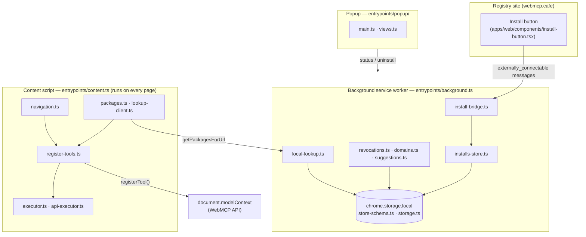
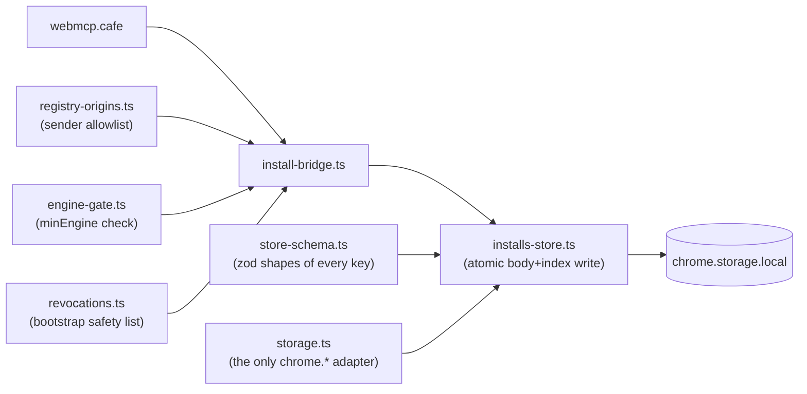
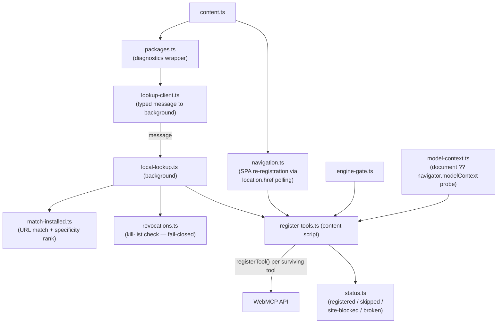
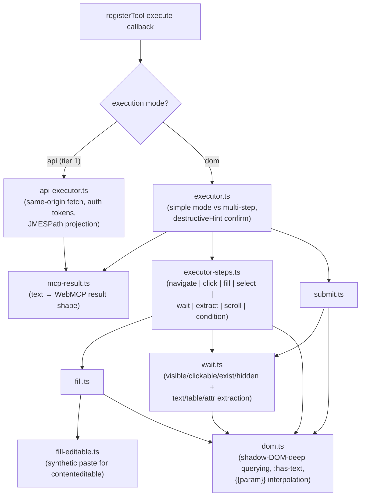
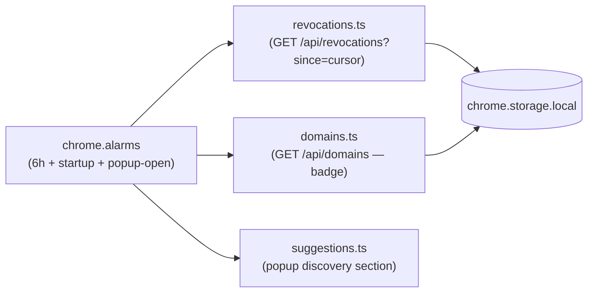

# Extension — Internal Architecture

The delivery mechanism for WebMCP Cafe: injects registry packages' tools into sites
that haven't implemented WebMCP. This document maps the extension's internals — the
three processes Chrome MV3 forces on us, the four flows every `src/lib/` file serves,
and where to look when something breaks. System-level flows (registration, invocation,
publish/install sequence diagrams): root `ARCHITECTURE.md`. Operational gotchas (dev
browser, storage keys, E2E recipe): `apps/extension/AGENTS.md`.

## The three processes

MV3 isolates the extension into three execution contexts that can only talk via
messages. Every lib file exists to serve one of them:

- **Background worker — the librarian.** Owns `chrome.storage.local`, handles
  installs, resolves lookups, and makes *all* of the extension's network calls (three
  polls, on `chrome.alarms`). Never touches a page.
- **Content script — the registrar + executor.** Runs at `document_idle` on every
  page, asks the background "anything installed for this URL?", registers surviving
  tools with the page's WebMCP API, and executes them when an agent calls. All
  logging lands in the page console.
- **Popup — the dashboard.** Read-mostly UI over the background's state: what matched
  this tab, the install list (with uninstall), paused/recovery states, suggestions.
  Never injects UI into the page.

## The four flows

`src/lib/` has 26 files but only four jobs. Read the directory by flow, not
alphabetically.

### ① Install flow — registry site → storage

*The site says "install"; the background validates and stores.*

- `install-bridge.ts` — the bouncer. Validates the sender origin against
  `registry-origins.ts`'s allowlist (the same constant `wxt.config.ts` turns into
  `externally_connectable` manifest patterns), fetches the version body from the
  *sender's* origin, re-verifies `apiContentHash`, and bootstraps the revocation list
  on first install (refuses with `revocation-unavailable` if it can't — nothing is
  written).
- `installs-store.ts` — atomic install, ordered uninstall, orphan GC, body loading.
  All storage I/O goes through an injected `StorageArea` seam (`storage.ts`) so tests
  use a fake, never `wxt/browser`.

### ② Page-load flow — URL → tools registered

*The hot path, on every page the user visits. Purely local — no network.*

- `register-tools.ts` — one registration pass (lookup → probe → skip
  engine-gated/colliding tools → register), with side effects injected so it is
  unit-testable. Reports `site-blocked` distinctly when a `Permissions-Policy:
  tools=()` page throws `SecurityError`.
- `navigation.ts` — content scripts can't see the page's `history.pushState`
  (isolated world), so SPA navigation is detected by polling `location.href` and
  re-running the pass with a fresh abort signal. Don't "fix" it by patching history.

### ③ Tool-invocation flow — agent calls a tool

*What happens when the in-page LLM invokes a registered tool.*

The DOM executor is a pyramid: `dom.ts` is pure primitives at the bottom,
`fill`/`wait`/`submit` are verbs in the middle, `executor-steps.ts`/`executor.ts`
orchestrate at the top. Ported from Joakim Selemyr's MIT webmcp-extension; no
`evaluate` step by design (no arbitrary code in the user's logged-in page).

### ④ Safety & discovery flow — background polling → popup

*The only network calls the extension makes, all on timers.*

`revocations.ts` is the fail-closed gate: if no revocation poll has ever succeeded,
installed packages stay dormant ("paused, waiting on the safety list"). The badge and
popup read the polled state; `status.ts` is the shared zod message vocabulary between
all three processes (page status, popup state, uninstall/install-suggestion
messages).

## Where to look when something breaks

| Symptom | Start at |
| --- | --- |
| A package won't install | `install-bridge.ts` → `installs-store.ts` |
| Tools didn't show up on a page | `register-tools.ts` → `local-lookup.ts` → `match-installed.ts` |
| Page console shows `0 installed package(s)` | expected with an empty store — not a failure |
| "Paused, waiting on the safety list" / `!` badge | `revocations.ts` (fail-closed gate; no poll has ever succeeded) |
| A tool runs but clicks the wrong thing | `executor-steps.ts` → `dom.ts` (selector rot — evaluate the selector against the live page first) |
| An API tool returns weird data | `api-executor.ts` (JMESPath projection, `errorPath`) |
| SPA navigation doesn't re-register tools | `navigation.ts` |
| What's actually in chrome.storage | `store-schema.ts` (`schemaVersion`, `index`, `pkg:<id>`, `revoked`) |
| Popup shows the wrong state | `status.ts` (message shapes) → `background.ts` badge logic |

## Why `src/lib/` is flat

The internal import graph is acyclic and shallow (`store-schema.ts` and `dom.ts` at
the bottom, `register-tools.ts` at the top), and each file's name already says which
flow it serves (`executor-*`, `lookup-*`, `*-store`). Subdirectories would duplicate
what the naming already encodes. If the DOM-executor cluster grows past ~10 files,
carve out `lib/executor/` first — it's the largest and most cohesive group.
