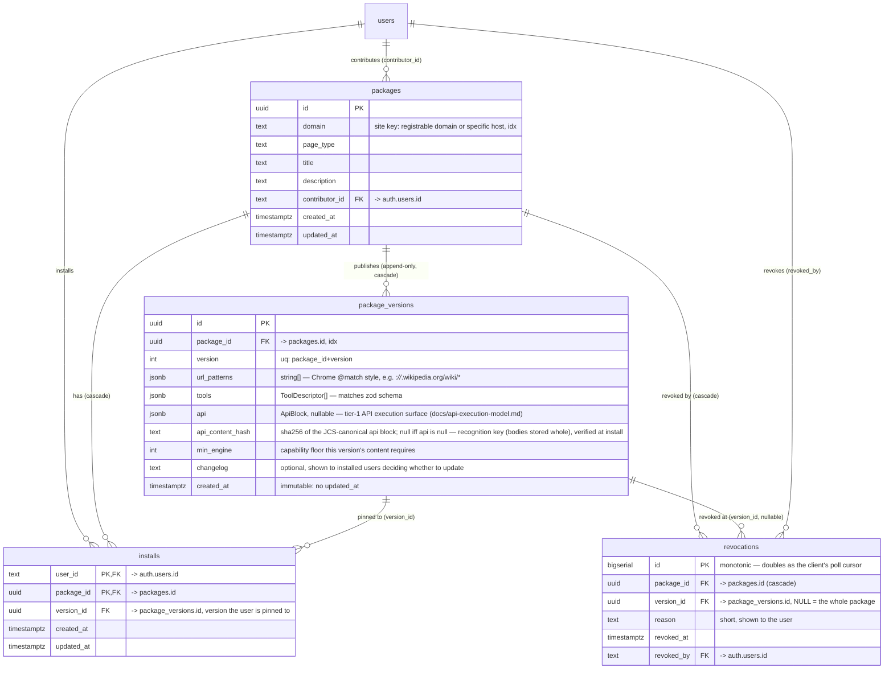
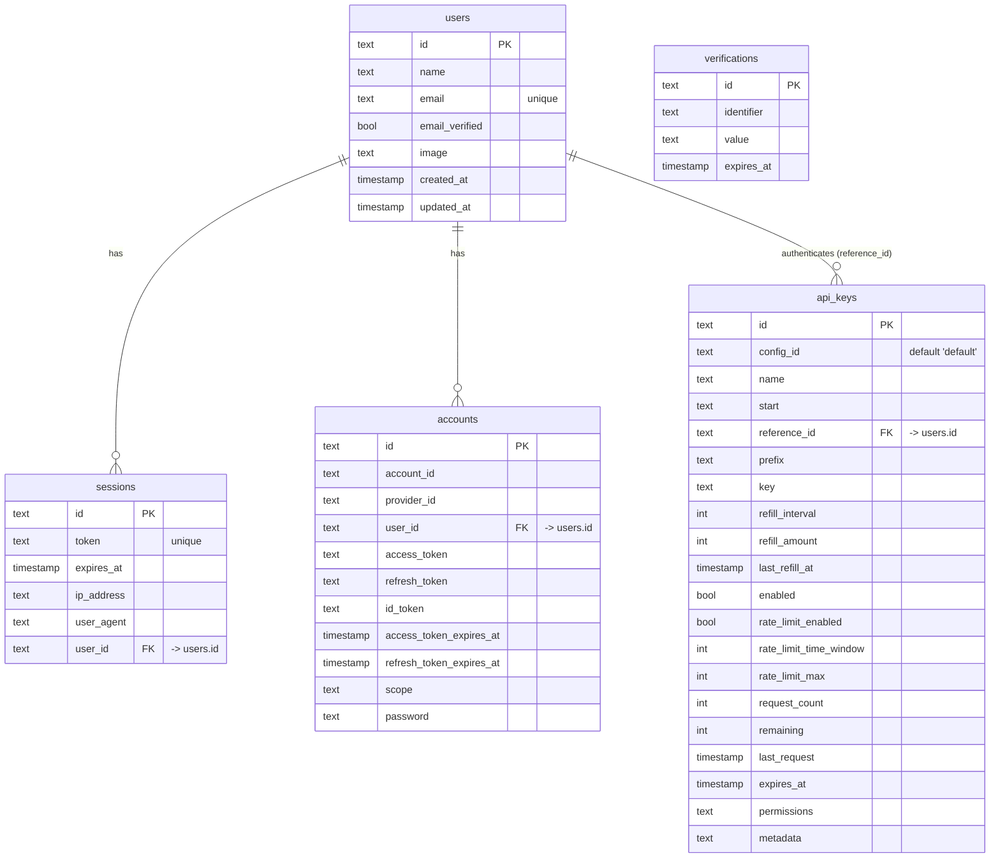

# WebMCP Cafe — ERD

Source of truth: `packages/db/src/*.ts` (Drizzle). Regenerate this diagram when the
schema changes.

## Registry tables (app-owned)

Package-install model: trust is readable data, explicit consent, and a version you
hold — not per-tool verification. There is no snapshot table — `package_versions`
rows are themselves the served truth.

These tables are in `public`; `users` below is the cross-schema `auth.users` (see the
next section). Mermaid entity names can't carry the qualifier, so the FK notes do.

## Auth tables (better-auth-owned — treat the shapes as fixed)

These live in the **`auth` Postgres schema**, not `public` — the tables below are all
`auth.users`, `auth.sessions`, … The split keeps the credential-bearing columns
(`accounts.access_token`/`refresh_token`, `api_keys.key`) behind one schema-level grant
and leaves `public` app-owned.

Column shapes come from better-auth's generated schema and must match the plugin's
expectations. The _table names_ are ours: better-auth resolves models against the
drizzle export names (`user`, `session`, …, `apikey` — kept singular in
`packages/db/src/auth-schema.ts`), never against the SQL name.

## Reading notes

- **Served truth:** `package_versions` rows directly — no separate snapshot table.
  Browse/fresh lookup serves `max(version)` per package. Installed users stay pinned
  to `installs.version_id` until they explicitly move the pin (npm-style, no
  auto-update); rollback is just setting `version_id` back to an older version.
- **Append-only versions:** publishing a new version never mutates or deletes an old one.
  `packages` (title/description/domain) is the one mutable row per
  package and is edited independently of publishing a version. `minEngine` lives on
  `package_versions`, not the package, since it's a property of a version's
  content.
- **No `(domain, url_pattern)` uniqueness — by design.** Packages are opinions, not
  registrations: rival packages may target the same site. Pattern specificity ranks
  them at lookup time (`rankPackagesByUrl` in `@robertn702/webmcp-cafe-schema`);
  an abandoned package never blocks a fresh replacement.
- **`installs` records account-side pins, not a trust signal.** `WHERE user_id = ?`
  is what the MCP server's `install_package` writes (and what the handoff link on
  the package page points at); `version_id` says which version the account is
  pinned to. The extension's local installs live in `chrome.storage.local`, not
  here — this table no longer drives a public trust number.
- **`revocations` is append-only and read-only over HTTP.** Served by
  `GET /api/revocations?since=<cursor>` (public, `WHERE id > cursor ORDER BY id`); writes
  are hand-run SQL in v1 — there is no admin role and no write endpoint. `id` is a
  `bigserial` rather than a random uuid precisely because it is that cursor. It exists
  for the local-install model (`docs/local-first-installs.md` §5): once package bodies
  live on the client's disk, this feed is the only lever the registry keeps after
  install.
