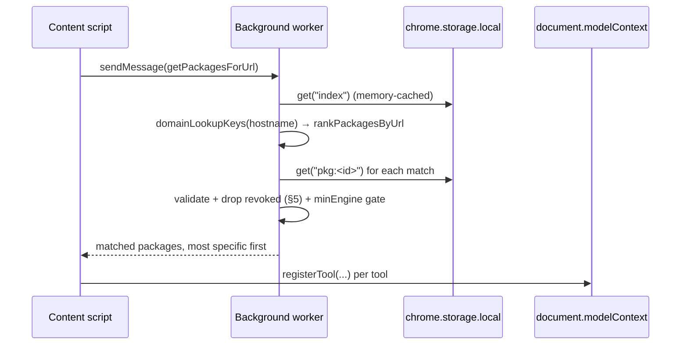

# Local-First Installs

> Design doc. Status: **steps 1–6 implemented; step 7 (drop `<all_urls>`) pending**
> (docs/DECISIONS.md 2026-07-25). The storage model, local page-load path, install
> bridge, revocation feed, domain sync, registry-backed suggestions, and install-count
> retirement all landed; what remains is the permission surgery that makes
> content-script injection per-origin. `ARCHITECTURE.md`, `docs/erd.md` and
> `apps/web/components/landing/mode-flows.ts` now describe the post-step-6 world.

**The decision:** installed packages move into the extension's `chrome.storage.local`. No
account is required to consume. Authentication is required only to publish.

Cross-device sync and signed-in install state are **deferred** — a known future want, out of
scope here, and deliberately not allowed to shape v1.

## Why

Three facts about the extension as built:

1. The content script matches `<all_urls>` (`apps/extension/src/entrypoints/content.ts:10`) and
   every page load — plus every SPA route change, caught by a 500 ms `location.href` poll
   (`apps/extension/src/lib/navigation.ts:36`) — sends the **full URL, path and query included**,
   to `GET /api/packages/lookup?url=` (`apps/extension/src/entrypoints/background.ts:64`). The
   registry receives a complete browsing-history feed. `docs/BACKLOG.md` plans a Chrome Web
   Store "no data collected" declaration, which is false as built.
2. There is no `chrome.storage` usage anywhere in `apps/extension/src`. The extension holds no
   state; the only offline data is the bundled fallback (`src/lib/packages.ts:13`).
3. `apps/web/app/api/packages/lookup/route.ts` is unauthenticated and always returns every
   package matching the URL at its latest version — there is no pinned-versions variant.
   **Install therefore has no effect on what registers**: any package anyone published for a
   site you visit auto-registers, installed or not, account or not.

Two landing-page trust claims are false because of (3) — `apps/web/app/page.tsx:194` ("Nothing
shows up on a page you didn't already read") and `:198` ("Your install is pinned to one
version"). Local installs make both true by construction rather than by promise:

| Property                  | Today                                             | After                                     |
| ------------------------- | ------------------------------------------------- | ----------------------------------------- |
| What registers on a page  | whatever the registry returns                     | only what this browser installed          |
| Version pinning           | claimed; not wired (lookup has no pinned variant) | real by possession — the body is on disk  |
| URL egress on page load   | every URL, every route change                     | none                                      |
| Account needed to consume | no (and the pin needs one)                        | no, and nothing is lost by not having one |

The pin becomes real by possession, URL matching happens on-device, and consumers never need an
account. That is the whole argument.

## 1. Storage model

`chrome.storage.local`, four top-level keys, hot index split from cold bodies:

| Key               | Shape                                                                                                  | Read on                 |
| ----------------- | ------------------------------------------------------------------------------------------------------ | ----------------------- |
| `schemaVersion`   | `number`                                                                                               | worker start            |
| `index`           | `{ [packageId]: { domain, urlPatterns, versionId, version, minEngine?, title, installedAt, source } }` | every page load         |
| `pkg:<packageId>` | the exact `WebMcpPackage` document served at install time                                              | only on a pattern match |
| `domains`         | `{ version, fetchedAt, domains: string[] }` (§4)                                                       | popup / badge           |
| `revoked`         | `{ cursor, fetchedAt, entries: RevocationEntry[] }` (§5)                                               | every registration      |

**Why split.** The page-load path needs `domain` + `urlPatterns` to decide, and nothing else.
At ~150 B per entry, 500 installs is a ~75 KB `index` — one `get`, cached in the background
worker, invalidated on `storage.onChanged`. Bodies are read only for the (usually zero or one)
packages that matched, so one fat package can never tax every page load. Key-per-body also means
an install/uninstall writes one key instead of rewriting a megabyte.

**Store the body, don't re-fetch it.** A pin you have to fetch is not a pin. Possession is what
makes the version guarantee real, keeps page loads network-free, and survives registry downtime.

**Validate on read, not just on write.** Run `webMcpPackageSchema` over each body when it is
loaded, the same boundary discipline `src/lib/registry-client.ts:36` applies to network
responses. Storage is writable from devtools and by older builds of ourselves. A body that fails
validation is skipped and marked broken in the popup — never half-registered.

**Quota.** `chrome.storage.local.QUOTA_BYTES` is 10,485,760 (10 MB), measured as JSON
stringification of keys plus values ([storage
API](https://developer.chrome.com/docs/extensions/reference/api/storage)). Measured against the
six curated packages (`packages/definitions/configs/*.json`, minified): 0.9–4.7 KB each, mean
~1.8 KB; the registry envelope (`id`, `versionId`, `contributor`, timestamps) adds ~0.2 KB. So
**500 installed packages ≈ 1 MB, 5% of quota**. Do not request `unlimitedStorage` — it carries
no permission warning, but asking for quota we demonstrably do not need is a review smell.
Revisit if a single package approaches ~100 KB.

**Migrations.** `schemaVersion` is an integer, bumped only when the on-disk shape changes.
Migrate in `runtime.onInstalled` (`reason === "update"`) **and** check defensively at worker
start. If the stored version is **newer** than the build (downgrade, profile sync), treat storage
as unreadable and register nothing rather than guessing — the same invariant `minEngine` already
enforces for package content (`apps/extension/src/lib/engine-gate.ts:16`): never half-run content
a build doesn't understand. Migrations are pure functions over the parsed object, unit-testable
without a browser.

## 2. Page-load path



The matching logic already exists twice and moves wholesale to the client: `domainLookupKeys` +
`rankPackagesByUrl` from `@robertn702/webmcp-cafe-schema` are what
`apps/extension/src/lib/packages.ts:42` already does for the bundled set and what
`apps/web/lib/lookup.ts:31` does server-side. No new matching code — the server-side copy simply
stops being on the hot path.

Concretely:

- **`src/lib/packages.ts`** — `getPackagesForUrl(url)` keeps its signature (so
  `src/lib/register-tools.ts` and its tests are untouched) and its body becomes: read index →
  filter on `domainLookupKeys` → `rankPackagesByUrl` → load + validate bodies → drop revoked.
  `BUNDLED_DOMAINS` and the fallback disappear (§6).
- **`src/lib/registry-client.ts`** — `fetchRegistryPackages` is deleted. The file keeps only the
  message-type plumbing, now for storage-backed lookups.
- **`src/entrypoints/background.ts`** — `fetchLookup` (`:61`–`:70`) is deleted. The worker keeps
  the per-tab status map and badge (`:80`–`:93`, unchanged), and gains: the storage lookup, the
  install message handler (§3), and `chrome.alarms` for the domain list and revocation polls.
- **Ranking** loses nothing. `rankPackagesByUrl` sorts on pattern specificity alone
  (`packages/schema/src/url-matching.ts:151`); `installCount` is serialized
  (`apps/web/lib/serialize.ts:28`) and displayed, but no code path has ever ordered by it —
  `apps/web/lib/lookup.ts:33` ranks by specificity and browse orders by `updatedAt`
  (`apps/web/lib/packages-repo.ts:84`). `ARCHITECTURE.md:180` and `mode-flows.ts:77` overstate
  this today; §7 resolves it.

**Keep the lookup in the background worker**, even though `storage.local` is readable from
content scripts. One in-memory index cache shared by every tab beats N per-frame reads, the
revocation check and refresh alarms are background concerns anyway, and the content script stays
the thin registration-only thing whose seams `register-tools.ts` unit-tests. Cost: the same one
message hop as today.

## 3. Install path

The website's Install button reaches the extension over `externally_connectable`.

```json
"externally_connectable": { "matches": ["https://webmcp.cafe/*", "http://localhost:3000/*"] }
```

Verified against current MV3 docs
([externally_connectable](https://developer.chrome.com/docs/extensions/reference/manifest/externally-connectable)):
`matches` lists **web pages** allowed to call `chrome.runtime.sendMessage(EXTENSION_ID, msg)`;
if the key is absent no web page can connect. One gotcha worth stating: declaring the key
without `"ids": ["*"]` stops other **extensions** connecting — which is what we want, but it is
a behaviour change, not a no-op.

Message protocol, versioned from day one (the site and the extension ship on independent
release cycles):

| Message                                         | Response                                                    |
| ----------------------------------------------- | ----------------------------------------------------------- |
| `{ v:1, type:"ping" }`                          | `{ ok:true, engine, extensionVersion }`                     |
| `{ v:1, type:"install", packageId, versionId }` | `{ ok:true, version } \| { ok:false, reason }`              |
| `{ v:1, type:"uninstall", packageId }`          | `{ ok:true } \| { ok:false, reason:"not-installed" }`       |
| `{ v:1, type:"list-installs" }`                 | `{ ok:true, installs:[{ packageId, versionId, version }] }` |

**The extension fetches the body, the page never supplies it.** The page hands over
`{ packageId, versionId }`; the background fetches it from the registry origin it already
holds host permission for (`apps/extension/wxt.config.ts:34`) and validates with
`webMcpPackageSchema`. Otherwise a compromised or spoofed page could hand the extension a body
that never came from the registry. This is attestation-by-origin, not cryptography — TLS to
`webmcp.cafe` is the trust boundary; signing version bodies is a later question (§Open).

**New registry endpoint — `GET /api/packages/:id/versions/:versionId`** (public, unauthenticated),
returning the same `webMcpPackageSchema` document at that exact version. Nothing version-scoped
exists today: the only GETs are `/api/packages` (latest), `/api/packages/:id` (latest) and
`/api/packages/lookup` (latest, or the caller's pins). The repo layer is already there —
`getVersionById` (`apps/web/lib/packages-repo.ts:114`) — so the route is thin. Add
`GET /api/packages/:id/versions` (list: version, versionId, changelog, createdAt) at the same
time; update and rollback both need it, and it is the same query.

**`install-button.tsx` gets rewritten.** It renders Install and Uninstall unconditionally and
never reads install state — its own TODO says so (`apps/web/components/install-button.tsx:8`).
Local installs finally make that fixable: `list-installs` on mount gives the true state, so the
component renders one correct action. It also needs an extension-absent branch (`ping` fails →
"Install the extension" linking `/extension`) replacing today's 401 → `/auth` fallback (`:32`).

**Pin the extension ID.** The site must hardcode an ID in `sendMessage`. Set `manifest.key` in
`wxt.config.ts` so unpacked, dev and Web Store builds share one ID; otherwise the site's
hardcoded ID is wrong in exactly the environment we test in.

## 4. Discovery without leaking URLs

The proposal on the table — sync a plain list of domains that have packages, light the badge
locally, send nothing — is correct, and correct for far longer than it looks.

- `GET /api/domains` → `{ version, generatedAt, domains: string[] }`, `ETag` + `Cache-Control`,
  derived from `SELECT DISTINCT domain FROM packages`. No identity, no URL, cacheable
  at the edge.
- Fetched on a `chrome.alarms` daily tick, on browser start, and on demand from the popup.
  Stored under `domains`.
- Matched against `domainLookupKeys(hostname)` (`packages/schema/src/url-matching.ts:76`) — the
  same key expansion the registry indexes on — not against the full URL.

**Scale.** A domain is ~15 bytes. 10k domains ≈ 150 KB raw, ~50 KB gzipped; 100k ≈ 1.5 MB,
still inside the 10 MB quota but an unpleasant download. Escalation path, in order:

1. **>~25k domains:** serve deltas (`GET /api/domains?since=<version>`), keep the list shape.
2. **>~250k domains:** switch to a Bloom filter (~300 KB at 1% false-positive for 250k entries),
   shipped as a versioned binary blob.

The rule that must survive both steps: **a filter hit is never resolved by asking the registry
about the URL.** That would reintroduce exactly the leak this design removes. A false positive
resolves into "open the popup to check", which is a user action, or it stays a slightly
over-eager badge. Today there are six packages; this is a list, and stays one.

## 5. Revocation

Mandatory, and the reason it is mandatory is structural: once bodies live on disk, a package
pulled for malware runs forever on every machine that has it unless something reaches out and
kills it. Local-first removes the registry from the read path, so the kill list is the **only**
lever the registry retains after install.

**Server.** New `revocations` table (`packages/db`), append-only:

| Column       | Note                                                     |
| ------------ | -------------------------------------------------------- |
| `id`         | monotonic — doubles as the client cursor                 |
| `package_id` | FK → `packages.id`                                       |
| `version_id` | FK → `package_versions.id`, **nullable** = whole package |
| `reason`     | short text, shown to the user                            |
| `revoked_at` | timestamptz                                              |
| `revoked_by` | FK → `user.id`                                           |

`GET /api/revocations?since=<cursor>` returns entries after the cursor. There is no admin role
in the app today, and v1 does not need one: the **write** path can be a hand-run SQL insert. The
**read** path is what must ship on every client from day one — a client shipped without it can
never be reached later, which is the whole failure mode.

**Client.** Poll on a `chrome.alarms` 6-hour tick, on browser start, and from the popup. The
request carries a cursor and nothing else. Enforcement happens at **registration time**, not
only at fetch time: `getPackagesForUrl` drops any package whose `packageId` (or installed
`versionId`) appears in `revoked`. Registration-time enforcement is what makes the kill list
apply to bodies already on disk; deleting the body on the next poll is hygiene, not the
mechanism.

**Fail-safe direction.** Revocation only ever removes capability, so a failed poll leaves the
last known list in place: stale-but-restrictive, never re-enabling. A revoked package is
surfaced in the popup with its reason — "1 package was pulled: <title> — <reason>" — never
silently vanished.

**Revocation is not auto-update.** A revoked version does not move the user to a newer one. It
stops registering and says why; moving the pin stays the user's explicit act (`PUT
/api/packages/:id/install` today, its local equivalent after).

One accepted risk, stated: the revocation endpoint becomes the highest-value target in the
system. Forging it disables packages (a denial-of-service against competitors) but cannot
install anything. v1 accepts TLS + same-origin; signing is a follow-up, tracked with body
signing.

## 6. The bundled fallback

`BUNDLED_DOMAINS` (`apps/extension/src/lib/packages.ts:13`) auto-registers five curated packages
whenever the registry returns nothing. In a consent model that is the same consent gap in
miniature, with a nicer curator.

**Recommendation: delete the auto-registering fallback.** `@webmcp-cafe/definitions` stays the
registry's seed source (`apps/web/scripts/seed.ts`) and becomes, in the extension, a **first-run
suggestion list** in the popup: "6 packages ready to install", each installing through the same
local path as any other package. One click, explicit, indistinguishable afterwards from a
registry install except for a `source: "bundled"` marker in the index.

Rejected alternative: pre-installing the six on first run. It is consent-by-default wearing an
install's clothes, and it muddies both the trust story and any future count.

This also kills the **silent-fallback trap** (`ARCHITECTURE.md:117`, `apps/extension/AGENTS.md`)
as a class — the registry is no longer in the page-load path, so there is nothing to silently
fall back from.

**The debugging convention changes with it.** `apps/extension/AGENTS.md:51` uses reddit's
exclusion from the bundle as the signal that a registry lookup failed. With no lookup and no
fallback, that signal is meaningless. Its replacement: the page-console ground truth becomes
`[webmcp-cafe] N installed package(s) matched this URL`, and "did the registry work" is tested on
the **install** path (site Install → `pkg:<id>` key exists) rather than on page load. Update that
file when the code lands, not before.

## 7. Install count

**Recommendation: drop it as a trust signal for v1.** Rank on pattern specificity alone — which
is what the code already does.

The reasoning, in order of weight:

1. An uninflatable count requires identity. Identity is exactly what this design removes from
   the consumer path. A count that anyone can inflate with `curl`, **labelled as trust**, is
   worse than no number: it invites the attack it pretends to defend against.
2. It changes no ordering anywhere. `rankPackagesByUrl` ignores it
   (`packages/schema/src/url-matching.ts:151`), lookup ranks by specificity
   (`apps/web/lib/lookup.ts:33`), browse orders by `updatedAt`
   (`apps/web/lib/packages-repo.ts:84`). It is displayed in three places only:
   `apps/web/app/(registry)/packages/page.tsx:47`, `packages/[id]/page.tsx:37`, and the landing
   hero sum (`apps/web/app/page.tsx:36`).
3. Six packages, zero users. The number carries no information today, and the cheap version
   (a counter table plus a public unauthenticated `POST`) buys a number nobody can trust.

Mechanics: `installCount` is already optional in the schema
(`packages/schema/src/registry.ts:16`), so simply stop populating it —
`fetchInstallCounts`/`hydrate` (`apps/web/lib/packages-repo.ts:29`) drops out and no consumer
breaks. `ARCHITECTURE.md:214` ("Trust = install count, not verification") and `docs/erd.md:138`
need rewriting when this lands; the honest v1 line is **trust = readable data, explicit consent,
and a version you hold**. Keep the `installs` table — it still records account-side pins made
while signed in (§8) — but stop deriving a public trust number from it. The landing hero's
`totalInstalls` (`apps/web/app/api/stats/route.ts:20`) becomes package and domain counts.

Revisit when specificity ties are common **and** there is a plausible anti-inflation story
(count only clients that later invoke the package, aggregate with noise). Both are post-launch
problems.

## 8. Mode 01 and the MCP install tools

With sync deferred, a terminal agent's `install_package` writes an `installs` row that no browser
reads. The tool (`packages/mcp/src/write-tools.ts`) currently promises an effect it does not
have — the landing copy says so explicitly at
`apps/web/components/landing/mode-flows.ts:83`.

**Recommendation: keep the tool, re-scope the description, and add a handoff link.** The MCP
package tools were freely renamed pre-publish (see `docs/DECISIONS.md` 2026-07-26) — nothing is
on npm yet, so there is no "breaks saved agent prompts" cost to weigh here. That freedom won't
last: once `@robertn702/webmcp-cafe-mcp` actually ships, a rename does break saved agent prompts,
so treat this as the last free rename. The description is what the model actually reads, so the
description is what must stop lying:

> `install_package` — Pin this package to a version **on your webmcp.cafe account**. This does not
> install into your browser; the extension's installs are local to the browser. Returns a link
> that installs this exact version there.

**The handoff link** is the whole fix for Mode 01 in the meantime: `install_package` returns
`https://webmcp.cafe/packages/<id>?install=<versionId>`. The agent prints it, the human clicks
once, the site's Install button runs §3 against that exact `versionId`. That is a one-line
server change plus a query-param branch on the package page, and it makes Mode 01 honest
end-to-end with no sync: the agent finds or authors the package and pins it; the human's click
is the consent step, which is where consent belongs anyway.

Landing copy to rewrite **when the code lands**: `mode-flows.ts:83`–`:90` (the `api → ext` step
describing the install pin), `:163` (bundled-fallback line), and `:152`/`:157` (per-page
content-script lookup).

## 9. Dropping `<all_urls>`

Researched against current Chrome MV3 documentation. Short answer: **technically yes, and it is
the right end state — but sequence it after the storage model, and know that it costs the
numeric badge on sites you have not installed anything for.**

### What the docs say

| Question                                                  | Finding                                                                                                                                                                                                                                                                                                        |
| --------------------------------------------------------- | -------------------------------------------------------------------------------------------------------------------------------------------------------------------------------------------------------------------------------------------------------------------------------------------------------------- |
| Can scripts be registered dynamically?                    | Yes. `chrome.scripting.registerContentScripts` (Chrome 96+); `persistAcrossSessions` defaults **true** ([scripting](https://developer.chrome.com/docs/extensions/reference/api/scripting))                                                                                                                     |
| Does that need host permission?                           | Yes — "to inject a content script programmatically, your extension needs host permissions for the page" ([content scripts](https://developer.chrome.com/docs/extensions/develop/concepts/content-scripts); MDN concurs)                                                                                        |
| Is today's `<all_urls>` content script already a warning? | Yes. `content_scripts.matches` triggers install warnings exactly like `host_permissions` ([declare permissions](https://developer.chrome.com/docs/extensions/develop/concepts/declare-permissions)), and `chrome.permissions`' `origins` explicitly includes "those associated with Content Scripts"           |
| Can the grant be requested from the page or the worker?   | **No.** `permissions.request()` must run inside a user gesture, is unavailable in content scripts, and forwarding a click through the service worker loses the gesture ([permissions](https://developer.chrome.com/docs/extensions/reference/api/permissions); [crbug.com/1284891](https://crbug.com/1284891)) |
| Cost of reading tab URLs in the background?               | `tabs` and `webNavigation` both warn **"Read your browsing history"** ([permissions list](https://developer.chrome.com/docs/extensions/reference/permissions-list)) — strictly worse than what we are removing                                                                                                 |
| Can the badge react to URLs without seeing them?          | Partly. `chrome.declarativeContent` (**no warning**) matches `PageStateMatcher({ pageUrl: { hostSuffix } })` and runs `ShowAction`/`SetIcon` **without host permissions**; Chrome does the matching, the extension never sees the URL                                                                          |
| Can declarative rules inject the script?                  | No. `RequestContentScript` is "still experimental and is not supported on stable builds" ([declarativeContent](https://developer.chrome.com/docs/extensions/reference/api/declarativeContent))                                                                                                                 |
| Does `permissions.addHostAccessRequest()` help?           | Not for discovery. Chrome 133+, but it is **one pattern per tab** and a new request overrides the previous — you must already know the tab's URL to pick the pattern                                                                                                                                           |

### The shape that works

- Manifest: drop `content_scripts` entirely; `optional_host_permissions: ["*://*/*"]`; keep
  `host_permissions` at the registry origins only (`wxt.config.ts:34`); add `scripting`,
  `storage`, `declarativeContent`. Every one of those four permissions is warning-free, so the
  install-time warning list becomes **empty** and the user instead sees a per-site prompt at the
  moment they install a package for that site.
- Install (§3) completes in two beats, because the grant cannot be silent: site Install →
  extension records the install and marks it `needs-access` → toolbar badge → user opens the
  popup → "Allow on reddit.com" button → `permissions.request({ origins: ["*://*.reddit.com/*"] })`
  → `registerContentScripts` for that domain → `executeScript` into already-open matching tabs
  (registration only affects future loads).
- `permissions.onRemoved` (the user revoking site access in Chrome's own UI) →
  `unregisterContentScripts` and flip the install back to `needs-access`.
- Discovery badge on sites with no install: `declarativeContent` rules generated from the
  domain list (§4) with a `SetIcon` action. **Limitation, stated plainly:** declarative actions
  can change the icon and enabled state but cannot set badge **text**, so the numeric tool count
  (`background.ts:80`) survives only on granted sites, where the content script still reports.
  Colour/icon = "packages available here"; number = "N tools registered here".

### Recommendation

Ship it as **step 6**, after installs are local and the install UX exists. The consent problem is
solved by local installs alone; the permission surgery changes the install flow for every
package and depends on popup work that does not exist yet; and landing both in one release makes
both undebuggable. Narrowing permissions later is free (Chrome only disables an extension pending
re-consent when warnings **increase**) — but the Chrome Web Store data declaration must be true
at submission, so submit whatever is true then and update the listing when this lands.

### Not verified

The practical rule-count ceiling for `declarativeContent` — the docs specify no cap (unlike
`declarativeNetRequest`). Resolve with a throwaway build in `.scratch/` that adds N rules and
times `addRules` plus a navigation. If it caps below a few thousand, the discovery badge either
collapses to coarse `hostSuffix` groupings or becomes popup-only via `activeTab` (warning-free,
user-initiated, and grants the popup the URL on click).

## 10. Implementation plan

Ordered. "Blast radius" is what breaks if the step is wrong.

| #   | Step                                                                                                                                                                                                               | Where                               | Blast radius                                                                         |
| --- | ------------------------------------------------------------------------------------------------------------------------------------------------------------------------------------------------------------------ | ----------------------------------- | ------------------------------------------------------------------------------------ |
| 1   | **Version-scoped reads** — `GET /api/packages/:id/versions/:versionId` + `GET /api/packages/:id/versions`, thin over `getVersionById` (`packages-repo.ts:114`)                                                     | `apps/web`                          | None — purely additive, nothing consumes it yet                                      |
| 2   | **Revocation read path** — `revocations` table + `GET /api/revocations?since=`; writes are hand-run SQL in v1                                                                                                      | `packages/db` migration, `apps/web` | Additive. Must precede step 3 shipping to users                                      |
| 3   | **Extension storage + local page-load path** — `storage` permission, the four keys, `getPackagesForUrl` off the network, `fetchLookup` deleted, bundle demoted to suggestions, revocation enforced at registration | `apps/extension`                    | High: the extension registers nothing until step 4. Separate PR from 4, same release |
| 4   | **Install path** — `externally_connectable` + message protocol, background version fetch, `install-button.tsx` rewrite, `manifest.key`                                                                             | `apps/extension`, `apps/web`        | High: this is the only way anything gets installed                                   |
| 5   | **Domain list** — `GET /api/domains`, alarm, popup "N packages available here"                                                                                                                                     | `apps/web`, `apps/extension`        | Low: cosmetic if it fails; nothing depends on it                                     |
| 6   | **Drop install count; reword MCP tools; handoff link** — stop populating `installCount`, stats route, browse/detail UI, `write-tools.ts:50`–`:83` descriptions, `install_package` returns the link                 | `apps/web`, `packages/mcp`          | Low, but `packages/mcp` is published — needs a changeset                             |
| 7   | **Drop `<all_urls>`** (§9) — `optional_host_permissions`, popup grant flow, `registerContentScripts`, `permissions.onRemoved`, `declarativeContent` discovery                                                      | `apps/extension`                    | Highest: changes install UX and the CWS warning set                                  |
| 8   | **Docs, when the code lands** (below)                                                                                                                                                                              | docs + `mode-flows.ts` + `page.tsx` | Documentation drift is the failure mode this row exists to prevent                   |

Steps 3 and 4 are the pair a user cannot receive separately: after 3 the extension has an empty
install set and no way to fill it. Ship them as two PRs in one release.

**Step 8, explicitly** — each of these describes today's design correctly and must change only
when the matching step ships:

- `ARCHITECTURE.md` "Runtime flow — tool registration" (`:85`–`:121`, the registry fetch and the
  bundled-fallback branch) and "Data flow — publish, install, serve" (`:161`–`:190`, the
  `installs`-pin story), plus "Trust = install count" (`:214`).
- `docs/erd.md` reading notes — the derived-trust note (`:138`) and the `installs` double-duty
  claim (`:140`).
- `apps/web/components/landing/mode-flows.ts:83`–`:90`, `:152`, `:157`, `:163`; and the two
  TrustFacts at `apps/web/app/page.tsx:194`, `:198` — which step 3+4 finally make true, so they
  stop being aspirational rather than getting deleted.
- `apps/extension/AGENTS.md` — the silent-fallback trap, the reddit-exclusion debugging signal
  (`:51`), and the structure notes describing the background fetch (`:60`).
- `apps/web/AGENTS.md` "Registry model (the served truth)" — the installs/pin paragraph (`:30`).

## Open questions

- **`declarativeContent` rule ceiling** (§9). Resolve by measurement in `.scratch/`.
- **Signing version bodies.** Attestation is origin-based today (§3). A signature would let the
  extension verify a body without trusting the transport and would harden the revocation feed
  (§5). Deferred: it needs a key-management story that does not exist.
- **Anonymous install counting** (§7). Only worth revisiting with an anti-inflation mechanism.
- **Update notifications.** A pinned install never auto-updates, which is the point — but the
  user must learn a new version exists. Cheapest honest version: the domain-list poll also
  returns `{ packageId, latestVersion }` for installed packages… which leaks the install set.
  Alternative: check on popup open only. Undecided; not blocking.

**Deferred, deliberately:** cross-device sync and signed-in install state. Note for whoever
picks it up — `chrome.storage.sync` is ~100 KB total and 8 KB per item, so package bodies could
never live there; sync would carry the install _list_ and re-fetch bodies per device.
